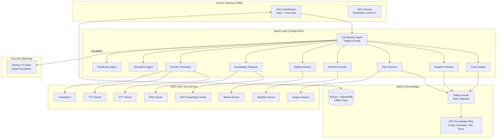

# 🌾 Krishi Sampark — Agentic Agriculture Advisor

> Offline-first, voice-first, multi-agent agriculture advisor for smallholder farmers  
> Built with Google ADK-inspired agents · FastAPI · MCP-style tools · PWA · Agent Skills-based AI-SDLC

[](pyproject.toml)
[](LICENSE)
[](https://google.github.io/adk-docs/)
[](mcp_servers/)

---

## 🏆 Kaggle Capstone Track

**Track: Agents for Good**

Krishi Sampark was created for the [AI Agents: Intensive Vibe Coding Capstone Project](https://www.kaggle.com/competitions/vibecoding-agents-capstone-project). It demonstrates a real-world agentic AI use case for agriculture, combining multi-agent coordination, MCP-style tool integrations, Agent Skills, safety checks, authentication, multilingual UX, mobile-first deployment, and an AI-led SDLC.

---

## 🌐 Live Demo

Krishi Sampark is hosted at:

**https://krishi.odisysai.com**

The app supports:
- Guest access for quick exploration
- Google sign-in for saved farm profile flows
- Mobile and tablet access
- Multilingual farmer-facing experience

---

## 🎯 The Problem

Smallholder farmers across India and East Africa often need timely guidance for crop health, irrigation, soil reports, pest risk, weather, and market prices. However, many farmers operate under limited connectivity, language barriers, low digital literacy, and limited access to expert agronomic support.

Existing digital tools often assume constant internet access, English literacy, or generic recommendations that may not account for local safety, crop stage, soil context, or uncertainty.

## 💡 The Solution

**Krishi Sampark** means "Agricultural Connection."

It is a multilingual, mobile-first agriculture advisory platform that helps farmers:
- Ask farming questions by text or voice
- Check crop issues using guided photo workflows
- Understand soil test reports
- Plan irrigation decisions
- View market prices
- Track farm activities
- Escalate complex or risky issues for expert help

The app combines a farmer-friendly interface with a coordinated set of specialist agents, MCP-style tools, safety checks, and an offline-first PWA design designed for limited-connectivity environments.

### Key Differentiators

| Feature | Description |
|---|---|
| 🌐 **Offline-First Design** | Local caching, IndexedDB farm twin, PWA service worker, and offline-friendly flows for limited-connectivity environments |
| 🗣️ **Voice-First UX** | Speech input and audio output patterns designed for farmers who prefer local-language interaction |
| 🤖 **Multi-Agent Architecture** | Coordinator plus specialist agents for crop, irrigation, pest, weather, market, knowledge, simulation, and dashboard support |
| 🛡️ **Agricultural Safety Kernel** | Safety checks for risky fertilizer, pesticide, chemical, dosage, and uncertainty scenarios |
| 🔌 **MCP-Style Tool Layer** | Modular tools for weather, market, knowledge retrieval, image analysis, translation, STT, and TTS |
| 📱 **Mobile PWA** | Installable web app with responsive mobile/tablet support and guest/authenticated access |
| 🧩 **Agent Skills AI-SDLC** | Reusable development skills for browser testing, localization validation, safety review, release readiness, and soil-report processing |
| 🤖 **AI-Led SDLC** | Lifecycle agents and reusable Agent Skills help manage requirements, architecture, development, testing, safety, security, release readiness, documentation, and observability |

---

## 🏗️ Architecture



### Agent Roster

| Agent | Role | Responsibility |
|---|---|---|
| **Coordinator** | Orchestrator | Triages farmer queries, routes to specialists, manages escalation |
| **Crop Analyst** | Specialist | Soil chemistry, NPK calibration, crop health diagnostics |
| **Irrigation Advisor** | Specialist | Drip scheduling, soil moisture thresholds, water optimization |
| **Pest Detector** | Specialist | Image-based pest/disease identification, organic & chemical remedies |
| **Weather Advisor** | Specialist | Microclimate analysis, planting/harvesting weather windows |
| **Market Advisor** | Specialist | Commodity pricing, mandi rates, harvest-sale timing |
| **Knowledge Retriever** | Retriever | OKF SPARQL queries, RAG semantic search over agronomy manuals |
| **Farmer Interaction** | Interface | Multilingual voice/audio handling, STT/TTS coordination |
| **Simulation Agent** | Simulator | What-If farm simulations, soil state predictions |
| **Dashboard Agent** | Interface | Declarative UI card generation, telemetry charts |

### MCP-Style Tool Servers

| Server | Protocol | Tools |
|---|---|---|
| **OKF** | stdio | Agricultural ontology & knowledge graph queries |
| **RAG** | stdio | Semantic search over agronomy documents |
| **Weather** | stdio | Local weather forecast & microclimate analysis |
| **Market** | stdio | Crop pricing, supply charts, financial tools |
| **Image Analysis** | stdio | Multimodal plant disease identification |
| **STT** | stdio | Speech-to-text transcription |
| **TTS** | stdio | Text-to-speech neural voice synthesis |
| **Translation** | stdio | Gemini-driven multilingual translation |

### Safety Kernel

The Safety Kernel implements **ADK `before_agent_callback` and `after_agent_callback`**
hooks that intercept every agent response to enforce:

- **Banned chemical blocking** — endosulfan, carbofuran, monocrotophos never recommended
- **Pesticide dosage limits** — max concentration, max application rate per OKF safety files
- **PHI enforcement** — pre-harvest interval checks before recommending any chemical spray
- **Low-confidence escalation** — uncertain diagnoses routed to human agronomist via Expert mode
- **Farmer UX invariants** — responses under 80 words, no markdown, warm "Krishi Sastri" persona

### Auth, Guest Mode & Deployment

- **Google OIDC sign-in** — authenticated users get saved farm profiles
- **Guest mode** — quick exploration without login
- **Session cookies** — HMAC-signed tokens with email, name, auth provider
- **Rate limiting** — expert chat limited to 10 queries per user per hour to control API costs
- **Mobile PWA** — installable, responsive, service worker caching
- **Deployment** — Docker, Terraform IaC for Google Cloud Run

---

## 🤖 AI-Led SDLC and Agent Skills

Krishi Sampark was developed using an AI-led software development lifecycle model. In addition to the product agents that support farmers, the project defines lifecycle agents and reusable skills that help manage requirements, architecture, development, testing, security, safety, release readiness, documentation, and observability.

This approach treats software delivery itself as an agent-assisted workflow.

### Lifecycle Agents

The project includes SDLC-focused agent personas under `.ai-sdlc/agents/`.

These lifecycle agents help guide different phases of delivery:

| Lifecycle Agent | Responsibility |
|---|---|
| Requirements Agent | Converts ideas and feature requests into traceable requirements and acceptance criteria |
| Architecture Agent | Reviews architecture impact, ADRs, offline-first design, and edge/cloud distribution |
| Developer Agent | Guides implementation, coding standards, compatibility, and self-checks |
| Test Agent | Manages unit, integration, browser, mobile, localization, and regression testing |
| Security Agent | Reviews secrets, dependencies, threat model, auth/authz, and secure coding controls |
| Safety Review Agent | Reviews agricultural safety rules, unsafe advice risks, and expert escalation needs |
| UX Accessibility Agent | Reviews farmer-friendly wording, mobile usability, accessibility, and language consistency |
| DevOps Agent | Reviews deployment, environment configuration, CI/CD, rollback, and hosting readiness |
| Release Agent | Aggregates evidence and determines release readiness based on gates |
| Documentation Agent | Keeps README, runbooks, architecture docs, and submission materials aligned |
| Observability Agent | Reviews logs, traces, user feedback, quality drift, and post-release health signals |

### Agent Skills

Reusable SDLC procedures are packaged as Agent Skills under `.ai-sdlc/skills/`.

Each skill is designed as a small, reusable capability that can be invoked by a coding agent or developer. Skills follow a portable folder pattern:

```text
.ai-sdlc/skills/<skill-name>/
├── SKILL.md
├── prompts/
├── references/
├── scripts/
└── assets/
```

Examples of project skills:

| Skill | Purpose |
|---|---|
| browser-testing | Runs browser/mobile UI validation and captures evidence |
| localization-validation | Checks translation keys, missing labels, and mixed-language UI |
| a2ui-schema-validation | Validates declarative UI schemas and action definitions |
| farmer-mode-language-review | Ensures farmer-facing screens avoid technical terms and use simple language |
| agricultural-safety-review | Reviews fertilizer, pesticide, crop disease, and safety-sensitive outputs |
| offline-pwa-validation | Checks service worker, IndexedDB, offline behavior, and PWA readiness |
| secret-scanning | Runs secret, dependency, and static security checks |
| release-readiness | Aggregates real evidence and returns READY / NOT_READY |
| code-review | Reviews code quality, standards, and compatibility |
| threat-modeling | Reviews threat model and security controls |

### Governance Layer

The `.ai-sdlc/` directory stores project governance and lifecycle evidence:

```text
.ai-sdlc/
├── agents/       # SDLC lifecycle agent definitions
├── policies/     # Security, safety, privacy, and release policies
├── workflows/    # Feature delivery and pull request workflows
├── gates/        # Quality, safety, security, and release gates
├── evidence/     # Test, scan, browser, safety, and approval evidence
└── reports/      # Traceability, quality scorecard, and release readiness reports
```

The project separates responsibilities clearly:

| Folder | Purpose |
|---|---|
| AGENTS.md | Global project rules and coding-agent guidance |
| .ai-sdlc/ | Governance, workflows, gates, evidence, and lifecycle reports |
| .ai-sdlc/skills/ | Portable reusable skills for coding agents |
| docs/ | Human-readable product, architecture, engineering, testing, and operations documentation |

### Evidence-Driven Delivery

The AI-led SDLC model avoids relying on agent-generated claims alone. Release readiness is based on evidence from real commands, tests, scans, and reviews.

Examples of evidence include:
- Unit and integration test results
- Browser and mobile viewport test results
- Localization validation results
- Agricultural safety test results
- Security scan outputs
- Release readiness reports
- Human approval records where required

If required evidence is missing or stale, the release process reports NOT_READY instead of producing a false pass.

### Why This Matters

This AI-led SDLC model demonstrates how agentic systems can support both:
1. **The end-user product** — Krishi Sastri and specialist agriculture agents helping farmers.
2. **The engineering lifecycle** — lifecycle agents and skills helping developers build, test, secure, document, and release the project responsibly.

This makes Krishi Sampark not only an agentic agriculture advisor, but also a demonstration of agent-assisted software engineering governance.

---

## 🚀 Quick Start

### Prerequisites

- Python 3.11+
- [uv](https://docs.astral.sh/uv/) package manager
- (Optional) `GEMINI_API_KEY` environment variable for cloud expert mode

### Setup & Run

```bash
# 1. Install dependencies
make setup

# 2. (Optional) Configure API keys
cp config/secrets.template.env .env
# Edit .env with your GEMINI_API_KEY

# 3. Start the FastAPI server
uv run python -m app.fast_api_app

# 4. Open the project
open http://localhost:8000/
# Or visit the live demo: https://krishi.odisysai.com
```

### ADK Playground (Agent Development)

```bash
# Launch the ADK interactive playground
uv run agents-cli playground
```

### Running Tests

```bash
make test              # Unit + integration tests
make lint              # Code formatting & linting
make typecheck         # Type checking
make ai-sdlc-check     # AI-SDLC validation gates
make coverage          # Test coverage with JUnit evidence
make release-check     # Release readiness evaluation
```

---

## 📁 Repository Layout

```text
agents/              10 ADK-inspired agents (coordinator + 9 specialists)
app/                 FastAPI backend, auth, telemetry, expert chat
ui/agui/             Farmer PWA dashboard (voice, camera, offline DB)
ui/a2ui/             Declarative A2UI canvas renderer
ui/assets/           Icons and images
ui/public/           Favicon and web manifest
ui/schemas/          A2UI declarative screen JSON layouts
mcp_servers/         8 MCP-style tool servers (STT, TTS, RAG, weather, etc.)
okf/                 Agricultural ontology (crops, diseases, soil, pests)
okf-knowledge-graph/ OKF knowledge graph data & schema
rag_pipeline/        RAG embeddings & retriever
safety_kernel/       ADK safety callback implementations
config/              Dev/prod configs & secrets template
deployment/          Terraform IaC for Cloud Run
docs/                Architecture, design, engineering docs
.ai-sdlc/            Governance, lifecycle agents, skills, evidence, reports
tests/               Unit, integration, and eval tests
```

---

## 🌍 Supported Languages

| Language | Code | Locale | Greeting |
|---|---|---|---|
| English | `en` | `en-US` | Hello |
| Hindi | `hi` | `hi-IN` | राम राम |
| Marathi | `mr` | `mr-IN` | राम राम |
| Telugu | `te` | `te-IN` | నమస్కారం |
| Swahili | `sw` | `sw-KE` | Jambo |
| Zulu | `zu` | `zu-ZA` | Sawubona |

---

## 🎬 Demo Walkthrough

Suggested demo flow:
1. Open the landing page at https://krishi.odisysai.com
2. Continue as Guest or sign in with Google
3. Complete or review farm onboarding
4. Open Home dashboard
5. Ask Krishi Sastri a farming question
6. Try Photo Check
7. Upload or review Soil Report workflow
8. Use Irrigation Planner
9. View Market Prices
10. Switch language
11. Show mobile/tablet layout
12. Explain safety kernel and expert escalation
13. Show `.ai-sdlc/` lifecycle model and Agent Skills

---

## ⚠️ Current Limitations

Krishi Sampark is a capstone/demo platform and should not be treated as a production agronomy replacement.

Current limitations:
- Some integrations may use sample or demo data.
- Real-world agronomy validation is required before production use.
- Local/offline model behavior depends on device and browser capability.
- Soil lab integration is planned but not fully implemented.
- Expert escalation workflow may require production backend integration for real operations.
- Multilingual coverage may require further field validation with native speakers.
- Recommendations should be reviewed by qualified agriculture experts for safety-critical use.

---

## 🔐 Security & Responsible Use

- All agronomic recommendations pass through the **Safety Kernel** (ADK callbacks)
- Banned chemicals are blocked at the framework level
- Low-confidence diagnoses escalate to expert help for risky or uncertain cases
- This is **safety-checked decision support**, not a replacement for certified agronomists
- Expert chat is rate-limited (10 queries per user per hour) to control API costs
- See [SECURITY.md](SECURITY.md) for vulnerability reporting
- **No API keys or credentials are committed** — see `config/secrets.template.env` for the template

---

## 🛠️ Technology Stack

| Layer | Technology |
|---|---|
| Agent Framework | Google ADK (Agent Development Kit) |
| Agent CLI | agents-cli (scaffold, playground, deploy) |
| Tool Protocol | MCP-style tool servers |
| Backend | FastAPI (Python) |
| Frontend | Vanilla JS PWA, A2UI declarative canvas |
| Local AI | Gemma 2B (WebGPU, in-browser) — experimental, device-capability dependent |
| Cloud AI | Gemini 2.5 Flash (expert escalation) |
| Knowledge | OKF (Open Knowledge Format) + RAG |
| Database | SQLite (server) + IndexedDB (client offline twin) |
| TTS/STT | Web Speech API + edge-tts + Gemini |
| Auth | Google OIDC + guest mode + HMAC-signed sessions |
| Deployment | Docker, Terraform, Cloud Run |
| CI/CD | GitHub Actions |

---

## 📚 Documentation

A complete documentation index is available at [docs/README.md](docs/README.md).

Key documents:
- [Product Vision](docs/01-product/product-vision.md)
- [Problem Statement](docs/01-product/problem-statement.md)
- [Architecture Overview](docs/02-architecture/architecture-overview.md)
- [Agent Architecture](docs/02-architecture/agent-architecture.md)
- [Data & Farm Twin Architecture](docs/02-architecture/data-and-farm-twin-architecture.md)
- [Farmer UX Guidelines](docs/03-design/farmer-ux-guidelines.md)
- [ADK Implementation Guide](docs/04-engineering/adk-implementation-guide.md)
- [Soil Report Workflow](docs/04-engineering/soil-report-workflow.md)
- [Evaluation & Safety Report](docs/05-testing/evaluation-and-safety-report.md)
- [AI-SDLC Operating Model](docs/06-devsecops/ai-sdlc-operating-model.md)
- [Agent Skills Operating Model](docs/06-devsecops/agent-skills-operating-model.md)
- [Runbook](docs/07-operations/runbook.md)
- [Current Status & Roadmap](docs/08-roadmap/current-status-and-roadmap.md)

---

## 📜 License

This project uses a **split license model**:

### Source Code — Apache License 2.0

All source code (Python, JavaScript, HTML, CSS, YAML, JSON configuration files)
is licensed under the **Apache License 2.0**.

- See [LICENSE](LICENSE) for the full license text
- You may use, modify, and distribute the source code under the terms of Apache 2.0

### Documentation & Visual Assets — CC BY 4.0

All documentation, diagrams, screenshots, writeup materials, project-generated
visual assets, and non-source-code content are licensed under
**Creative Commons Attribution 4.0 International (CC BY 4.0)**.

- See [LICENSE-DOCS](LICENSE-DOCS) for the full license notice
- You may share and adapt these materials with appropriate attribution

### Third-Party Notices

This project uses third-party open-source libraries, Google Cloud services,
pretrained models, and external APIs. The project owners do not claim ownership
over these third-party components.

- See [NOTICE](NOTICE) for a complete list of third-party dependencies and attributions
- No API keys, credentials, or secrets are included in this repository

### Kaggle Capstone Submission Note

If selected as a winning submission, the project owner is prepared to grant the competition sponsor the license described in the competition rules for showcasing and promoting this submission.

## 🤝 Contributing

Please read [CONTRIBUTING.md](CONTRIBUTING.md) before opening pull requests.

---

> **Krishi Sampark** — *A guided agriculture support assistant for smallholder farmers, designed for limited-connectivity environments.* 🌾

