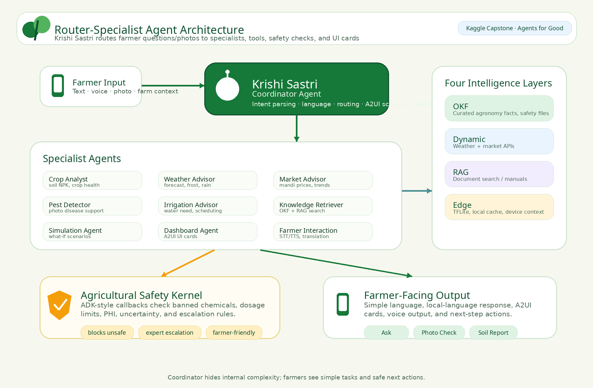

# Agent Architecture

> **Status:** Active
> **Last Updated:** 2026-07-06
> **Owner:** Architecture
> **Related ADR:** [ADR-AAA-003](adr/ADR-AAA-003-agent-skills-based-ai-sdlc.md)

---

## Router-Specialist Pattern



Krishi Sastri acts as the farmer-facing coordinator. It receives user input, interprets intent, applies language and farm context, routes to specialist agents, invokes MCP-style tools, and returns simple farmer-facing guidance or A2UI cards. Complex, risky, or uncertain scenarios can be escalated to Krishi Visheshagya / Expert Help.

The system implements a decoupled, hierarchical multi-agent team using Google ADK:

```
Farmer's Query / Photo
       │
       ▼
┌─────────────────────────────────────────────────────┐
│        Krishi Sastri (Coordinator Agent)              │
│  • Parses intent, language, farm context              │
│  • Routes to specialist sub-agents                    │
│  • Translates and formats response                   │
│  • Emits A2UI JSON schemas for UI cards              │
│  • Enforces safety kernel on all prescriptions       │
└───────────────────────┬─────────────────────────────┘
                        │
        ┌───────────────┼───────────────┐
        ▼               ▼               ▼
┌─────────────┐ ┌─────────────┐ ┌─────────────┐
│ Crop        │ │ Weather     │ │ Market      │
│ Analyst     │ │ Advisor     │ │ Advisor     │
│             │ │             │ │             │
│ Soil NPK,   │ │ 7-day       │ │ 6 crops,    │
│ health      │ │ forecast,   │ │ Yahoo Fin., │
│ checks      │ │ frost alert │ │ INR/KES    │
└─────────────┘ └─────────────┘ └─────────────┘
        ▼               ▼               ▼
┌─────────────┐ ┌─────────────┐ ┌─────────────┐
│ Pest        │ │ Irrigation  │ │ Knowledge   │
│ Detector    │ │ Advisor     │ │ Retriever   │
│             │ │             │ │             │
│ Gemini Vis.,│ │ Water req., │ │ OKF SPARQL, │
│ OKF disease │ │ moisture %  │ │ RAG search  │
└─────────────┘ └─────────────┘ └─────────────┘
        ▼               ▼               ▼
┌─────────────┐ ┌─────────────┐ ┌─────────────┐
│ Simulation  │ │ Dashboard   │ │ Farmer      │
│ Agent       │ │ Agent       │ │ Interaction │
│             │ │             │ │             │
│ Sandbox     │ │ UI schema   │ │ Voice/chat  │
│ step/run    │ │ config      │ │ translation │
└─────────────┘ └─────────────┘ └─────────────┘
```

## Agent Registry

| Agent | Role | Model | MCP-Style Tools | Status |
|-------|------|-------|-----------|--------|
| `coordinator_agent` | Orchestrator | Configured Gemini Flash | `get_ui_schema` | ✅ Active |
| `crop_analyst_agent` | Specialist | Configured Gemini Flash | OKF, RAG | ✅ Active |
| `weather_advisor_agent` | Specialist | Configured Gemini Flash | weather (Open-Meteo) | ✅ Active |
| `market_advisor_agent` | Specialist | Configured Gemini Flash | market (Yahoo Finance) | ✅ Active |
| `irrigation_advisor_agent` | Specialist | Configured Gemini Flash | OKF, weather | ✅ Active |
| `pest_detector_agent` | Specialist | Configured Gemini Flash | OKF, image_analysis, safety | ✅ Active |
| `knowledge_retriever_agent` | Retriever | Configured Gemini Flash | OKF, RAG | ✅ Active |
| `simulation_agent` | Simulator | Configured Gemini Flash | simulation tools | ✅ Active |
| `dashboard_agent` | Interface | Configured Gemini Flash | schema tools | ✅ Active |
| `farmer_interaction_agent` | Interface | Configured Gemini Flash | TTS, STT, translation | ✅ Active |

Registry file: `agents/agent_registry.yaml`

**Status markers:** ✅ Active · ⚠️ Partial / Prototype · 🧭 Roadmap

## Agent Responsibility Boundaries

| Agent | Boundary |
|---|---|
| Coordinator / Krishi Sastri | Routes, summarizes, formats, and escalates; does not bypass safety checks |
| Crop Analyst | Provides crop and soil decision support; does not issue guaranteed prescriptions |
| Pest Detector | Supports photo-based triage; uncertain cases must escalate |
| Irrigation Advisor | Provides planning support; does not override local water restrictions or farmer judgment |
| Market Advisor | Provides indicative market information; does not provide financial guarantees |
| Knowledge Retriever | Retrieves curated/documented knowledge; does not invent unsupported agronomy facts |
| Farmer Interaction | Handles language, voice, and UX; does not expose internal technical terminology to farmers |
| Dashboard Agent | Emits UI schema/cards; does not replace source-of-truth data validation |
| Simulation Agent | Provides what-if exploration; not a validated crop yield prediction engine |

## Four Intelligence Layers

| Layer | Type | Example | Source | Runtime |
|-------|------|---------|--------|---------|
| **OKF** | Curated reference | Crop, pest, soil, safety facts | `okf-knowledge-graph/data/` | Local/server file read |
| **Dynamic** | Fresh data | Weather, market prices | MCP-style APIs | Online fetch |
| **RAG** | Document search | Agronomy manuals and guides | `rag_pipeline/` embeddings | Vector search where documents are ingested |
| **Edge** | Local/offline context | Farm Twin, cached data, lightweight models | IndexedDB / browser APIs | In-browser, device-dependent |

## MCP-Style Tool Integration

| Server | Data Source | Status | Crops/Features |
|--------|-------------|--------|----------------|
| `weather` | Open-Meteo API | ✅ Working | 7-day forecast, frost alerts |
| `market` | Yahoo Finance API | ✅ Working | 6 crops (corn, wheat, soybeans, cotton, rice, sugarcane) |
| `okf` | OKF knowledge graph files | ✅ Working | 22 entities, search across crops/diseases/pests/soil/safety |
| `rag` | RAG pipeline embeddings | ⚠️ Pipeline ready | Pipeline built, zero documents ingested |
| `image_analysis` | Gemini Vision API | ✅ Working | Pest/disease photo analysis (requires API key) |
| `tts` | edge-tts | ✅ Working | Neural voices for multiple languages |
| `stt` | Browser Web Speech | ✅ Working | BCP-47 language codes, 6 languages |
| `translation` | Backend translation | ✅ Working | 6 languages (English, Hindi, Marathi, Telugu, Swahili, Zulu) |

## Safety Flow

1. User request and farm context are received by Krishi Sastri.
2. The coordinator identifies whether the request is safety-sensitive.
3. Specialist agents retrieve knowledge, data, or tool outputs as needed.
4. `safety_before_agent` checks tool outputs and intermediate content where applicable.
5. `safety_after_agent` checks the final response for banned chemicals, dosage issues, PHI rules, uncertainty, and escalation requirements.
6. If the response fails safety checks, it is blocked, rewritten, or escalated to Expert Help.
7. The farmer receives simple, safety-aware guidance and next steps.

## Safety Kernel Integration

The Safety Kernel is designed to reduce unsafe agricultural guidance. It does not guarantee correctness and should be combined with expert review for safety-critical use.

The Safety Kernel implements two ADK callback functions:

- **`safety_before_agent`** — Inspects pending tool outputs for chemical/pesticide mentions; checks against `pesticide_limits.md`
- **`safety_after_agent`** — Validates final response for banned chemicals, dosage violations, PHI breaches; blocks or flags

Safety data sources:
- `okf-knowledge-graph/data/safety/pesticide_limits.md` — 10 pesticides with max concentration, max rate, PHI
- `okf-knowledge-graph/data/safety/pre_harvest_intervals.md` — Typical PHI by pesticide type
- `okf-knowledge-graph/data/safety/organic_standards.md` — Organic certification requirements

## Related Documents

- [Architecture Overview](architecture-overview.md)
- [Data & Farm Twin Architecture](data-and-farm-twin-architecture.md)
- [Edge-Cloud Advisor Architecture](edge-cloud-advisor-architecture.md)
- [ADR-AAA-003: Agent-Skills-Based AI-SDLC](adr/ADR-AAA-003-agent-skills-based-ai-sdlc.md)
- [ADR-AAA-005: Safety Kernel](adr/ADR-AAA-005-agricultural-safety-kernel.md)