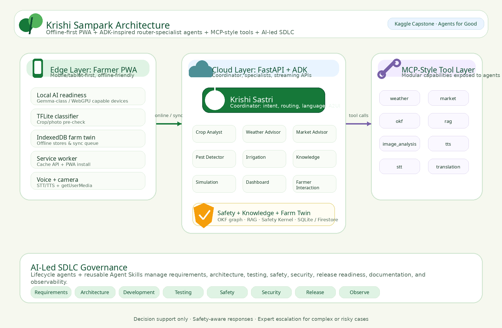

# Architecture Overview

> **Status:** Active
> **Last Updated:** 2026-07-06
> **Owner:** Architecture

---

## System Architecture



Krishi Sampark uses a router-specialist multi-agent pattern aligned with Google ADK concepts, with a decoupled edge-cloud architecture designed for limited-connectivity farming environments. The system combines a mobile PWA, local/offline-friendly data stores, cloud-hosted agent coordination, MCP-style tools, curated agriculture knowledge, and safety-aware response validation.

```
┌─────────────────────────────────────────────────────────────┐
│                    EDGE LAYER (PWA)                         │
│  ┌──────────────┐  ┌──────────────┐  ┌──────────────────┐  │
│  │ Local AI    │  │ TFLite       │  │ IndexedDB        │  │
│  │ (WebGPU,    │  │ Classifier   │  │ (11 stores)      │  │
│  │ experimental)│  │              │  │                  │  │
│  └──────────────┘  └──────────────┘  └──────────────────┘  │
│  ┌──────────────┐  ┌──────────────┐  ┌──────────────────┐  │
│  │ Service Worker│  │ Voice STT/TTS│  │ Camera (getUserMedia)│
│  │ (Cache API)  │  │ (Web Speech)  │  │                  │  │
│  └──────────────┘  └──────────────┘  └──────────────────┘  │
└──────────────────────────┬──────────────────────────────────┘
                           │ (online/offline routing)
                           ▼
┌─────────────────────────────────────────────────────────────┐
│                   CLOUD LAYER (FastAPI)                      │
│  ┌──────────────────────────────────────────────────────┐   │
│  │           Krishi Sastri (Coordinator Agent)           │   │
│  │  ┌─────────┬─────────┬─────────┬─────────┬──────────┐ │   │
│  │  │Crop     │Weather  │Market   │Pest     │Irrigation│ │   │
│  │  │Analyst  │Advisor  │Advisor  │Detector │Advisor   │ │   │
│  │  └─────────┴─────────┴─────────┴─────────┴──────────┘ │   │
│  │  ┌─────────┬─────────┬─────────┬─────────┐             │   │
│  │  │Knowledge│Simul-   │Dashboard│Farmer   │             │   │
│  │  │Retriever│ation    │Agent    │Interact.│             │   │
│  │  └─────────┴─────────┴─────────┴─────────┘             │   │
│  └──────────────────────────────────────────────────────┘   │
│  ┌──────────────────────────────────────────────────────┐   │
│  │              MCP-Style Tool Servers (8)               │   │
│  │  weather │ market │ okf │ rag │ image_analysis        │   │
│  │  tts     │ stt    │ translation                       │   │
│  └──────────────────────────────────────────────────────┘   │
│  ┌──────────────────────────────────────────────────────┐   │
│  │  OKF Knowledge Graph │ RAG Pipeline │ Safety Kernel   │   │
│  └──────────────────────────────────────────────────────┘   │
│  ┌──────────────────────────────────────────────────────┐   │
│  │  Firestore Farm Twin + User Content Index             │   │
│  └──────────────────────────────────────────────────────┘   │
└─────────────────────────────────────────────────────────────┘
```

## Key Architectural Decisions

| Decision | ADR | Rationale |
|----------|-----|-----------|
| Multilingual UI with translation keys | [ADR-AAA-001](adr/ADR-AAA-001-multilingual-ui-architecture.md) | 6 languages, instant switching, script purity |
| Offline-first PWA with IndexedDB | [ADR-AAA-002](adr/ADR-AAA-002-offline-first-pwa-indexeddb-sync.md) | Designed for limited-connectivity environments |
| Agent-skills-based AI-SDLC | [ADR-AAA-003](adr/ADR-AAA-003-agent-skills-based-ai-sdlc.md) | Lifecycle agents and reusable skills support evidence-driven delivery |
| Edge-cloud advisor routing | [ADR-AAA-004](adr/ADR-AAA-004-edge-cloud-advisor-routing.md) | Simple/offline-friendly flows use local context where possible; complex, risky, or uncertain cases use cloud/expert assistance |
| Agricultural Safety Kernel | [ADR-AAA-005](adr/ADR-AAA-005-agricultural-safety-kernel.md) | Safety-sensitive recommendations are checked for chemicals, dosage, PHI, uncertainty, and escalation rules |
| Two-pane layout (content + chat) | — | Chat always visible; agent-triggered schemas render in content pane without replacing chat |
| Same-origin ADK endpoints | — | FastAPI serves both ADK `/run_sse` and static UI on port 8000; no separate port needed |

## Technology Stack

| Layer | Technology | Version/Config |
|-------|-----------|----------------|
| Agent Framework | Google ADK | `google-adk>=2.0.0` |
| LLM | Configured Gemini Flash model | Gemini 2.5 Flash (expert escalation), temperature-tuned per agent |
| Backend | FastAPI | Port 8000, SSE streaming, serves ADK + static UI |
| Frontend | Vanilla JS PWA | Two-pane layout (content + chat), Service worker |
| Database | Firestore / IndexedDB / Cloud Storage | Firestore Emulator locally, Firestore Native in cloud, IndexedDB client offline twin, Cloud Storage for uploaded files |
| MCP-Style Tools | Python | 8 tool servers (weather, market, okf, rag, image_analysis, tts, stt, translation) |
| Voice | Web Speech API + edge-tts | Browser-native STT, backend neural TTS (edge-tts) |
| Local Models | Experimental | Gemma-class WebGPU model where supported, device and browser dependent |

## Folder Structure

```
agentic-agri-advisor/
├── agents/                  # Python ADK-inspired agents (coordinator + 9 specialists)
├── app/                     # FastAPI server & endpoints
├── ui/agui/                 # PWA frontend (dashboard, voice, camera, translations)
├── ui/a2ui/                 # A2UI declarative UI rendering engine
├── mcp_servers/             # 8 MCP-style tool servers
├── okf-knowledge-graph/     # OKF knowledge graph data & schema
├── rag_pipeline/            # RAG document search pipeline
├── safety_kernel/           # Agricultural Safety Kernel
├── simulation/              # Farm simulation sandbox
├── data/                    # Firestore data manager facade
├── tests/                   # Unit, integration, eval tests
├── .ai-sdlc/                # AI-SDLC governance (agents, skills, workflows, evidence)
├── tools/ai_sdlc/           # AI-SDLC validation CLI scripts
└── docs/                    # This documentation
```

## Runtime Flow

1. A farmer asks a question, speaks, uploads a crop photo, or opens a guided farm workflow.
2. The PWA reads local farm, crop, field, language, and activity context from the offline Farm Twin where available.
3. The app determines whether the request can be handled with local/offline-friendly capabilities or should be routed to the cloud.
4. Krishi Sastri receives the request with farmer context, language, crop, field, and workflow state.
5. Krishi Sastri routes the request to one or more specialist agents.
6. Specialist agents call MCP-style tools for weather, market, OKF knowledge, RAG search, image analysis, translation, STT, or TTS as needed.
7. The Safety Kernel checks safety-sensitive advice, including pesticide, fertilizer, dosage, PHI, chemical, uncertainty, and escalation rules.
8. The response is returned as simple farmer-facing guidance, voice output, and/or A2UI cards.
9. Activity, feedback, and sync events are stored in the Farm Twin for future context and later synchronization.

## AI-Led SDLC Architecture

In addition to farmer-facing agents, Krishi Sampark includes lifecycle agents and reusable Agent Skills that support the software delivery lifecycle.

The AI-led SDLC layer helps manage:
- Requirements
- Architecture reviews
- Development guidance
- Testing
- Browser/mobile validation
- Localization validation
- Agricultural safety review
- Security review
- Release readiness
- Documentation
- Observability

The project separates responsibilities across:

| Area | Purpose |
|---|---|
| `AGENTS.md` | Global coding-agent guidance and project rules |
| `.ai-sdlc/` | Lifecycle agents, workflows, gates, policies, evidence, and reports |
| `.ai-sdlc/skills/` | Portable reusable skills for coding agents and developers |
| `docs/` | Human-readable architecture, product, engineering, testing, and operations documentation |

This demonstrates two layers of agentic design:
1. **Product agents** that help farmers
2. **Lifecycle agents and skills** that help build, test, secure, document, and release the product responsibly

## Current Implementation Status

| Capability | Status | Notes |
|---|---|---|
| PWA shell and responsive UI | ✅ Implemented | Mobile/tablet farmer interface |
| Guest mode | ✅ Implemented | Quick access for demo exploration |
| Google sign-in | ✅ Implemented | OIDC-based, saved farm profiles |
| IndexedDB Farm Twin | ✅ Implemented | Client-side offline data stores |
| Service worker / PWA caching | ✅ Implemented | Service worker with cache versioning |
| Krishi Sastri coordinator | ✅ Implemented | Router for farmer requests |
| Specialist agents | ✅ Implemented | 10 agents registered in agent_registry.yaml |
| MCP-style tool layer | ✅ Implemented | 8 tool servers (weather, market, OKF, RAG, image, STT, TTS, translation) |
| RAG pipeline | ⚠️ Pipeline ready | Pipeline built, zero documents ingested |
| Local browser model | ⚠️ Experimental | Gemma-class WebGPU, device and browser dependent |
| Safety Kernel | ✅ Implemented | Banned chemicals, dosage limits, PHI checks, escalation |
| Expert escalation | ⚠️ Demo workflow | Cloud Gemini 2.5 Flash; production expert network is future work |
| Soil report workflow | ✅ Implemented | Upload, extract, confirm, save |
| Soil lab integration | 🧭 Roadmap | Future integration |
| AI-led SDLC framework | ✅ Implemented | `.ai-sdlc/` with lifecycle agents, skills, gates, evidence |
| Rate limiting | ✅ Implemented | Expert chat limited to 10 queries per user per hour |
| Admin dashboard | ✅ Implemented | Protected by ADMIN_EMAIL env var |

**Status markers:** ✅ Implemented · ⚠️ Prototype / Partial · 🧭 Roadmap

## Architecture Boundaries

Krishi Sampark is a decision-support platform and capstone demo. It is not a replacement for certified agronomists, extension officers, or local regulatory guidance.

The system does not:
- Provide guaranteed agronomic prescriptions
- Replace local expert review for safety-critical decisions
- Autonomously approve pesticide or fertilizer use
- Guarantee correctness of AI-generated guidance
- Store secrets or credentials in the frontend
- Treat AI-generated advice as final expert validation

Safety-sensitive guidance should be reviewed by qualified agriculture experts before real-world use.

## Related Documents

- [Agent Architecture](agent-architecture.md)
- [Data & Farm Twin Architecture](data-and-farm-twin-architecture.md)
- [Edge-Cloud Advisor Architecture](edge-cloud-advisor-architecture.md)
- [Hybrid Intelligence Strategy](hybrid-intelligence-strategy.md)
- [ADR-AAA-003: Agent-Skills-Based AI-SDLC](adr/ADR-AAA-003-agent-skills-based-ai-sdlc.md)
- [ADR-AAA-005: Agricultural Safety Kernel](adr/ADR-AAA-005-agricultural-safety-kernel.md)
